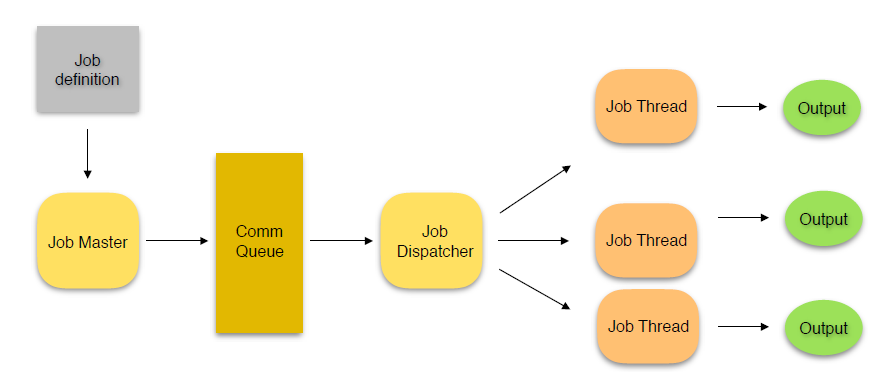

#Job Processing Application

##Design and implementation of a Job Processing application as per the below mentioned diagram

Job definition: a text file describing the work to be done

Job Master: the application that will read content of job definition file as an input 

Comm Queue:  Message Queue IPC to communicate between Job Master and Job Dispatcher

Job Dispatcher: processes job request from Comm Queue and dispatch to process the job

Job Thread: temporary entity started to process a job request

Output: output file in the specified format

##Design Details

#####Job Definition File
Job definition file describes the job requests to be processed by Job Master. The format is as
follows:
SORT_ASC ~/input_dir/name_list.txt ~/output_dir/sorted_name_list.txt
SORT_DSC ~/input_dir/name_list2.txt ~/output_dir/sorted_name_list2.txt
AVG ~/input_dir/score_raw.txt ~/output_dir/score_avg.txt
MED ~/input_dir/score_raw.txt ~/output_dir/score_med.txt
STD ~/input_dir/score_raw.txt ~/output_dir/score_std.txt

#####Job Input File
Input files are in text format and can contain either all integers or all text strings. For example:
File ‘raw.txt’:
10 98 25 50 60 70 84 95 100 …

File ‘list.txt’:
John David Lisa Beth Rose Vincent …

#####Job Output File
The output file will have the following format:
Job ID: (some unique ID)
Result:
(Output of job here.)

#####Supported Commands
SORT_ASC: sort text string in ascending order
SORT_DSC: sort text string in descending order
AVG: calculate average of numerical inputs
MED: calculate median value of input numbers
STD: calculate standard deviation of input numbers

##Steps of Execution

Created a jobDefinition.txt file and passed SORT_ASC, SORT_DSC, AVG, MED, STD in it

Created a jobManager.c file in which I have implemented the concept of message queue using which I am reading the content of jobDefinition.txt file one by one and sending it to jobDispatcher .c

Created jobDispatcher .c in which I am receiving the message sent from jobManager.c and performing various operations like sorting in ascending, sorting in descending, computing average, median and Standard deviation (wrote separate method for all computations).

##Result

Displayed the output on screen along with storing in different files as per requirement.

